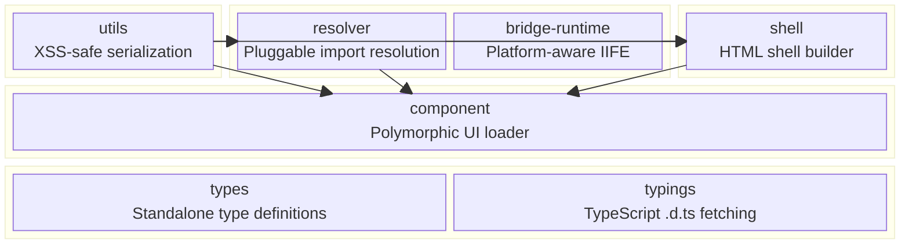
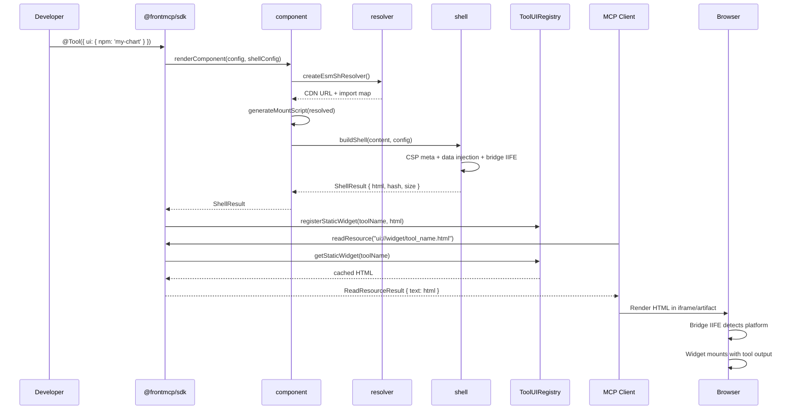
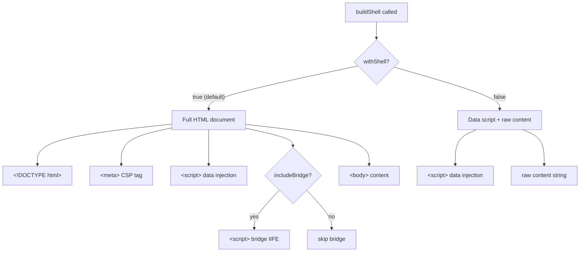

# @frontmcp/uipack

HTML shell builder, pluggable import resolver, and NPM component loader for MCP UI development. React-free core.

[](https://www.npmjs.com/package/@frontmcp/uipack)

## Package Split

| Package            | Purpose                                                    | React Required |
| ------------------ | ---------------------------------------------------------- | -------------- |
| `@frontmcp/uipack` | Shell builder, import resolution, component loader, bridge | No             |
| `@frontmcp/ui`     | React components, layouts, widgets, web components         | Yes (peer dep) |

## Install

```bash
npm install @frontmcp/uipack
```

---

## Architecture Overview

The library is composed of 7 focused modules:



**Dependency summary:**

| Module           | Depends on                            |
| ---------------- | ------------------------------------- |
| `utils`          | _(none — foundation)_                 |
| `types`          | _(standalone)_                        |
| `typings`        | _(standalone, uses zod)_              |
| `resolver`       | `utils`                               |
| `bridge-runtime` | _(standalone)_                        |
| `shell`          | `utils`, `resolver`, `bridge-runtime` |
| `component`      | `utils`, `resolver`, `shell`          |

---

## End-to-End Flow: Tool UI to Browser



---

## Module Deep-Dives

### Resolver — Pluggable Import Resolution

Transforms bare import specifiers (`react`, `chart.js`) into CDN URLs for browser consumption.

**Key exports:**

| Export                            | Type      | Purpose                                                           |
| --------------------------------- | --------- | ----------------------------------------------------------------- |
| `ImportResolver`                  | interface | `{ resolve(specifier, context?) → ResolvedImport }`               |
| `createEsmShResolver()`           | function  | Default resolver using esm.sh with CDN registry fallback          |
| `DEFAULT_CDN_REGISTRY`            | constant  | Pre-configured entries for react, react-dom, chart.js, d3, lodash |
| `parseImports(source)`            | function  | Regex-based parser → named, default, namespace, dynamic imports   |
| `rewriteImports(source, opts)`    | function  | Rewrites bare specifiers to CDN URLs in source code               |
| `createImportMap(deps)`           | function  | Generates browser-standard import map from resolved deps          |
| `generateImportMapScriptTag(map)` | function  | `<script type="importmap">` tag generation                        |
| `mergeImportMaps(...maps)`        | function  | Deep-merge multiple import maps                                   |
| `lookupPackage(name)`             | function  | Query the CDN registry for a package                              |
| `getPackageCDNUrl(name)`          | function  | Resolve package to best CDN URL                                   |

**CDN registry ships with:** react (v19), react-dom (v19), chart.js (v4), d3 (v7), lodash (v4) — each with cloudflare, jsdelivr, unpkg, and esm.sh providers.

```ts
import { createEsmShResolver, createImportMap } from '@frontmcp/uipack/resolver';

const resolver = createEsmShResolver({
  providerOrder: ['cloudflare', 'jsdelivr'],
});

const result = resolver.resolve('chart.js');
// → { value: 'https://cdnjs.cloudflare.com/ajax/libs/Chart.js/4.5.1/chart.umd.min.js', type: 'url' }
```

---

### Shell — HTML Shell Builder

Wraps content in a complete HTML document with CSP, data injection, and the bridge runtime.

**Key exports:**

| Export                           | Type     | Purpose                                                                              |
| -------------------------------- | -------- | ------------------------------------------------------------------------------------ |
| `buildShell(content, config)`    | function | Main entry point → `ShellResult`                                                     |
| `ShellConfig`                    | type     | `{ toolName, resolver?, csp?, withShell?, input?, output?, includeBridge?, title? }` |
| `ShellResult`                    | type     | `{ html: string; hash: string; size: number }`                                       |
| `buildCSPMetaTag(csp?)`          | function | Generate `<meta>` CSP tag                                                            |
| `buildCSPDirectives(csp?)`       | function | Merge custom domains with defaults                                                   |
| `buildDataInjectionScript(opts)` | function | `<script>` setting `window.__mcp*` globals                                           |
| `createTemplateHelpers()`        | function | `escapeHtml`, `formatDate`, `formatCurrency`, `uniqueId`, `jsonEmbed`                |
| `DEFAULT_CDN_DOMAINS`            | constant | jsdelivr, cloudflare, Google Fonts                                                   |

**Shell modes:**



```ts
import { buildShell } from '@frontmcp/uipack/shell';

const result = buildShell('<div id="root"></div><script type="module">/*...*/</script>', {
  toolName: 'get_weather',
  input: { city: 'London' },
  output: { temp: 18 },
  includeBridge: true,
  csp: { connectDomains: ['https://api.weather.com'] },
});

// result.html → full HTML doc with CSP, data injection, bridge, and content
// result.hash → fast 32-bit hash
// result.size → byte length
```

---

### Component — Polymorphic UI Component Loading

Loads UI components from 4 different source types, resolves their dependencies, and renders them through the shell.

**4 source modes:**

| Mode       | Config shape                                      | Description                      |
| ---------- | ------------------------------------------------- | -------------------------------- |
| **npm**    | `{ npm: 'my-chart', exportName?, version? }`      | Resolved via CDN registry/esm.sh |
| **file**   | `{ file: './widget.html', inline? }`              | Local file path                  |
| **import** | `{ import: 'https://cdn.example.com/widget.js' }` | Direct URL passthrough           |
| **inline** | `(input, output) => '<div>...</div>'`             | Function returning HTML string   |

**Key exports:**

| Export                                                              | Type     | Purpose                                                     |
| ------------------------------------------------------------------- | -------- | ----------------------------------------------------------- |
| `renderComponent(config, shell)`                                    | function | Top-level compositor → `ShellResult`                        |
| `resolveUISource(source, opts)`                                     | function | Resolve any source to `ResolvedComponent`                   |
| `generateMountScript(resolved)`                                     | function | ES module mount script for React/module components          |
| `UIConfig<In, Out>`                                                 | type     | `{ source, props?, withShell?, includeBridge? }`            |
| `ResolvedComponent`                                                 | type     | `{ mode, url?, html?, exportName, meta, peerDependencies }` |
| `isNpmSource`, `isFileSource`, `isImportSource`, `isFunctionSource` | guards   | Type narrowing helpers                                      |

```ts
import { renderComponent } from '@frontmcp/uipack/component';

// npm source — resolved to CDN URL with import map
const result = renderComponent(
  { source: { npm: 'my-weather-widget', exportName: 'WeatherCard' } },
  { toolName: 'get_weather', output: { temp: 18 }, includeBridge: true },
);

// inline function source — immediate HTML generation
const result2 = renderComponent(
  { source: (input, output) => `<div>${output.temp}°C</div>` },
  { toolName: 'get_weather', input: { city: 'London' }, output: { temp: 18 } },
);

// import URL source — direct CDN URL
const result3 = renderComponent(
  { source: { import: 'https://esm.sh/my-widget@1.0.0' } },
  { toolName: 'my_tool', includeBridge: true },
);

// file source
const result4 = renderComponent({ source: { file: './widgets/chart.html', inline: true } }, { toolName: 'get_data' });
```

---

### Bridge Runtime — Platform-Aware IIFE

Generates a vanilla JavaScript IIFE that auto-detects the host platform and exposes `window.FrontMcpBridge`.

**Key exports:**

| Export                      | Type     | Purpose                                                                |
| --------------------------- | -------- | ---------------------------------------------------------------------- |
| `generateBridgeIIFE(opts?)` | function | Generate the bridge IIFE string                                        |
| `generatePlatformBundle(p)` | function | Platform-specific bundles (`chatgpt`, `claude`, `gemini`, `universal`) |
| `UNIVERSAL_BRIDGE_SCRIPT`   | constant | Pre-generated script with all adapters                                 |
| `BRIDGE_SCRIPT_TAGS`        | constant | `{ universal, chatgpt, claude, gemini }` — pre-wrapped `<script>` tags |
| `IIFEGeneratorOptions`      | type     | `{ adapters?, debug?, trustedOrigins?, minify? }`                      |

**Platform adapters (auto-detected by priority):**

| Adapter | Detects via                           | Priority | Key capabilities                      |
| ------- | ------------------------------------- | -------- | ------------------------------------- |
| OpenAI  | `window.openai.callTool`              | 100      | callTools, sendMessages, displayModes |
| ExtApps | `window.__mcpPlatform === 'ext-apps'` | 80       | Negotiated via postMessage handshake  |
| Claude  | `window.claude`, hostname `claude.ai` | 60       | openLinks only                        |
| Gemini  | `window.__mcpPlatform === 'gemini'`   | 40       | openLinks, networkAccess              |
| Generic | Always matches (fallback)             | 0        | openLinks, networkAccess              |

**`window.FrontMcpBridge` API:**

- `callTool(name, args)` — invoke an MCP tool from the widget
- `getToolOutput()` / `getToolInput()` — read injected data
- `sendMessage(content)` — send message to host
- `openLink(url)` — open a URL via platform adapter
- `requestDisplayMode(mode)` — switch inline/fullscreen/pip
- `setWidgetState(state)` — persist widget state to localStorage
- `onContextChange(callback)` — subscribe to host context changes
- `onToolResult(callback)` — subscribe to tool result events
- `hasCapability(cap)` — check adapter capabilities
- `getTheme()` / `getDisplayMode()` / `getHostContext()`

---

### Typings — TypeScript .d.ts Fetching

Fetches TypeScript type definitions from esm.sh for IDE-powered widget development.

**Key exports:**

| Export                     | Type     | Purpose                                            |
| -------------------------- | -------- | -------------------------------------------------- |
| `TypeFetcher`              | class    | Main fetcher with caching and recursion            |
| `createTypeFetcher(opts?)` | function | Factory creating a `TypeFetcher` instance          |
| `MemoryTypeCache`          | class    | LRU cache with TTL support                         |
| `globalTypeCache`          | constant | Module-level singleton cache (500 entries, 1h TTL) |
| `parseDtsImports(content)` | function | Parse `.d.ts` files for imports/references         |
| `combineDtsContents(map)`  | function | Combine multiple `.d.ts` files into one            |

**How it works:**

1. Parse import statements from user code
2. Check allowlist (`react`, `react-dom`, `zod`, `@frontmcp/*` by default)
3. HEAD request to `https://esm.sh/{pkg}@{version}` → reads `X-TypeScript-Types` header
4. GET the `.d.ts` URL, recursively follow imports up to `maxDepth` (default 4)
5. Return `TypeFile[]` with virtual `node_modules/` paths for editor integration

```ts
import { createTypeFetcher } from '@frontmcp/uipack/typings';

const fetcher = createTypeFetcher({
  allowedPackages: ['react', 'zod', '@frontmcp/*'],
  maxDepth: 3,
  timeout: 10_000,
});

const result = await fetcher.fetchBatch({
  imports: ["import { z } from 'zod'"],
});
// result.results[0].files → TypeFile[] with virtual paths
```

---

### Types — Standalone Type Definitions

SDK-independent type definitions usable by external consumers. No runtime code beyond type guards and constants.

**Configuration types** (from `ui-config.ts`):

| Type                       | Purpose                                                                      |
| -------------------------- | ---------------------------------------------------------------------------- |
| `UITemplateConfig<In,Out>` | Main UI template configuration (~25 fields)                                  |
| `WidgetServingMode`        | `'auto' \| 'inline' \| 'static' \| 'hybrid' \| 'direct-url' \| 'custom-url'` |
| `WidgetDisplayMode`        | `'inline' \| 'fullscreen' \| 'pip'`                                          |
| `UIContentSecurityPolicy`  | `{ connectDomains?, resourceDomains? }`                                      |
| `TemplateContext<In,Out>`  | `{ input, output, structuredContent?, helpers }`                             |
| `TemplateHelpers`          | `{ escapeHtml, formatDate, formatCurrency, uniqueId, jsonEmbed }`            |

**Runtime types** (from `ui-runtime.ts`):

| Type                | Purpose                                                 |
| ------------------- | ------------------------------------------------------- |
| `UIType`            | `'html' \| 'react' \| 'mdx' \| 'markdown' \| 'auto'`    |
| `WidgetManifest`    | Full widget manifest with schema, CSP, assets, hash     |
| `ToolResponseMeta`  | `_meta` fields for UI/OpenAI metadata in tool responses |
| `CSPDirectives`     | Content Security Policy directive map                   |
| `RendererAssets`    | CDN resource URLs per renderer type                     |
| `WidgetConfig<I,O>` | Comprehensive widget config for tool decorators         |

**Type guards:** `isUIType()`, `isBundlingMode()`, `isResourceMode()`, `isOutputMode()`, `isDisplayMode()`

**Constants:** `DEFAULT_CSP_BY_TYPE`, `DEFAULT_RENDERER_ASSETS`

---

### Utils — XSS-Safe Serialization

Foundation utilities used by shell, resolver, and component modules. Zero dependencies.

| Function               | Purpose                                                                      |
| ---------------------- | ---------------------------------------------------------------------------- |
| `escapeHtml(str)`      | Escapes `&`, `<`, `>`, `"`, `'`, U+2028/2029                                 |
| `escapeHtmlAttr(str)`  | Lighter escape for attributes: `&` and `"`                                   |
| `escapeJsString(str)`  | Escapes for JS string literals                                               |
| `escapeScriptClose(s)` | Replaces `</` with `<\/` to prevent `</script>` breakout                     |
| `safeJsonForScript(v)` | JSON serialize for safe `<script>` embedding (handles BigInt, circular refs) |
| `safeStringify(v, s?)` | `JSON.stringify` with circular reference detection                           |

---

## Entry Points

| Path                              | Purpose                      |
| --------------------------------- | ---------------------------- |
| `@frontmcp/uipack`                | Main barrel (re-exports all) |
| `@frontmcp/uipack/resolver`       | Import resolution            |
| `@frontmcp/uipack/shell`          | HTML shell builder           |
| `@frontmcp/uipack/component`      | Component loader             |
| `@frontmcp/uipack/bridge-runtime` | Platform bridge IIFE         |
| `@frontmcp/uipack/typings`        | .d.ts type fetching          |
| `@frontmcp/uipack/types`          | Type definitions             |
| `@frontmcp/uipack/utils`          | Escaping utilities           |

---

## Shell HTML Structure

Annotated output of `buildShell` with `withShell: true` and `includeBridge: true`:

```html
<!DOCTYPE html>
<html lang="en">
  <head>
    <meta charset="UTF-8" />
    <meta name="viewport" content="width=device-width, initial-scale=1.0" />
    <title>get_weather</title>

    <!-- CSP: default CDN domains + custom connectDomains/resourceDomains -->
    <meta
      http-equiv="Content-Security-Policy"
      content="default-src 'self'; script-src 'self' 'unsafe-inline' https://cdn.jsdelivr.net ..."
    />

    <!-- Data injection: tool context as window globals -->
    <script>
      window.__mcpToolName = 'get_weather';
      window.__mcpToolInput = { city: 'London' };
      window.__mcpToolOutput = { temp: 18 };
      window.__mcpStructuredContent = null;
    </script>

    <!-- Bridge IIFE: auto-detects platform, exposes window.FrontMcpBridge -->
    <script>
      (function () {
        /* ... platform adapters, FrontMcpBridge class ... */
      })();
    </script>
  </head>
  <body>
    <!-- Content from resolver + component (import map, mount script, etc.) -->
    <script type="importmap">
      { "imports": { "react": "https://esm.sh/react@19" } }
    </script>
    <div id="root"></div>
    <script type="module">
      import { WeatherCard } from 'https://esm.sh/my-weather-widget';
      /* mount logic */
    </script>
  </body>
</html>
```

---

## Related Packages

- [`@frontmcp/ui`](../ui) — React components that consume these helpers
- [`@frontmcp/sdk`](../sdk) — Core framework, decorators, and ToolUIRegistry
- [`@frontmcp/testing`](../testing) — UI assertions for automated testing

## License

Apache-2.0 — see [LICENSE](../../LICENSE).
